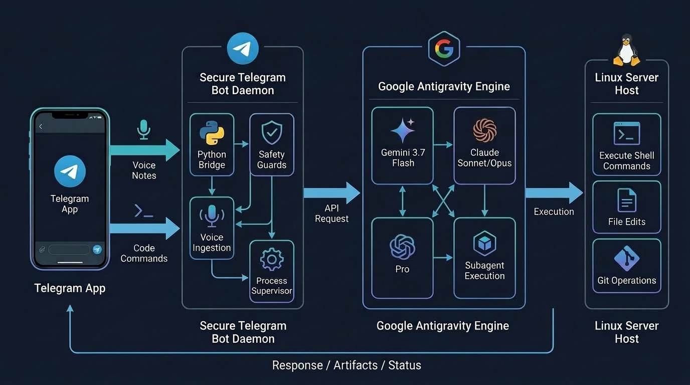

# Antigravity Telegram Bridge

An autonomous 24/7 mobile interface and daemon bridge for Google Antigravity (AGY) and Claude Code running on Linux hosts.

Turn any local Linux machine or homelab server into an always-available coding agent accessible directly through Telegram with voice memo ingestion, token burn telemetry, model hot-swapping, and session state persistence.



---

## Key Capabilities

* **Headless Autonomous Execution:** Dispatches prompts to `agy -p "<prompt>"` with `--dangerously-skip-permissions` and structured JSON response parsing.
* **Voice Note Ingestion:** Send voice memos directly in Telegram. The bridge downloads audio files (`.m4a`, `.ogg`, `.mp3`) and injects them into Antigravity for native transcription, requirement extraction, and automated note-taking.
* **Model Hot-Swapping:** Switch active reasoning models on the fly via slash commands (`/gemini`, `/gemini_high`, `/claude`, `/opus`, `/pro`, `/gpt`).
* **Live Step-by-Step Progress Monitoring:** Real-time milestone streaming displays current tool actions (`⚡ Run command`, `📝 Edit file`, `🔍 Search`) in an interactive status message while the agent is reasoning.
* **Sticky Session Auto-Reset:** Prevents infinite timeout loops. If a long-running multi-turn session exceeds context thresholds, the session ID is automatically flushed so the next prompt begins on a fresh, fast turn.
* **Token Burn Telemetry:** Tracks input tokens, output tokens, thinking tokens, and latency per turn across models via the `/stats` command.
* **Hard Stop & Cancellation:** `/stop`, `/abort`, or `/cancel` immediately issues `SIGKILL` to the process group (`killpg`), terminating runaway tasks and background subagents instantly.

---

## Quickstart Installation

### 1. Prerequisites
* Linux OS (Ubuntu, Debian, Arch, or Fedora)
* Python 3.10+
* Google Antigravity CLI (`agy`) installed and authenticated on the host machine (`~/.local/bin/agy`)

### 2. Clone and Setup Environment

```bash
git clone https://github.com/your-username/antigravity-telegram-bridge.git
cd antigravity-telegram-bridge

# Create virtual environment
python3 -m venv venv
source venv/bin/activate

# Install dependencies
pip install python-telegram-bot httpx python-dotenv
```

### 3. Configure Credentials

Copy `.env.example` to `.env` and fill in your values:

```bash
cp .env.example .env
nano .env
```

```ini
BOT_TOKEN=your_telegram_bot_token_here
ALLOWED_USER_ID=your_telegram_numeric_id
DEFAULT_WORKSPACE=/home/user
DEFAULT_MODEL=gemini-3.7-flash-medium
AGY_BIN=~/.local/bin/agy
```

* Obtain `BOT_TOKEN` by creating a bot via **@BotFather** on Telegram.
* Obtain your numeric user ID via **@userinfobot**. All messages from unauthorized accounts are strictly dropped.

### 4. Run Locally

```bash
python3 bot.py
```

---

## Telegram Commands Reference

| Command | Action |
| :--- | :--- |
| `/start` | Display active model, workspace directory, and command overview |
| `/gemini` or `/gemini_medium` | Switch active engine to Gemini 3.7 Flash (Medium Effort) |
| `/gemini_high` or `/high` | Switch active engine to Gemini 3.7 Flash (High Effort) |
| `/gemini_low` or `/low` | Switch active engine to Gemini 3.7 Flash (Low Effort) |
| `/claude` or `/sonnet` | Switch active engine to Claude Sonnet 4.6 (Thinking) |
| `/opus` | Switch active engine to Claude Opus 4.6 (Thinking) |
| `/pro` | Switch active engine to Gemini 3.1 Pro (High) |
| `/gpt` | Switch active engine to GPT-OSS 120B (Medium) |
| `/model <name>` | Switch to any registered model alias |
| `/stats` | View total token burn, average turn latencies, and model breakdown |
| `/context` | View active session turn count, step count, and compression state |
| `/cd <path>` | Switch host working directory for subsequent agent tool calls |
| `/pwd` | Print current host working directory |
| `/new` or `/reset` | Flush session context and start fresh conversation thread |
| `/stop` or `/cancel` | Issue SIGKILL to running process group and kill execution |

---

## 24/7 Deployment with Systemd

To run the bridge as a background daemon that restarts automatically on system boot:

1. Create a user unit file:

```bash
mkdir -p ~/.config/systemd/user
nano ~/.config/systemd/user/antigravity-bridge.service
```

2. Add configuration:

```ini
[Unit]
Description=Antigravity Telegram Bridge Service
After=network.target

[Service]
Type=simple
WorkingDirectory=/home/user/antigravity-telegram-bridge
ExecStart=/home/user/antigravity-telegram-bridge/venv/bin/python3 /home/user/antigravity-telegram-bridge/bot.py
Restart=always
RestartSec=3

[Install]
WantedBy=default.target
```

3. Enable and start:

```bash
systemctl --user daemon-reload
systemctl --user enable --now antigravity-bridge.service
```

4. Check logs:

```bash
journalctl --user -u antigravity-bridge.service -f
```

---

## License

This project is licensed under the [MIT License](LICENSE). Free for personal and commercial homelab development.
